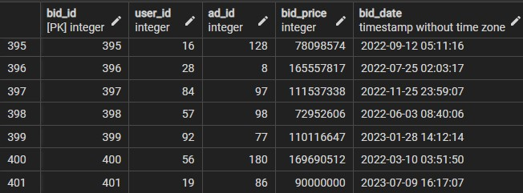
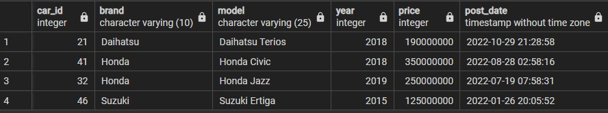

# Used Car E-commerce Database System
PostgreSQL Database implementation for A Used Car E-commerce data management.

## Feature and Limitation
1. Users can offer one or multiple used cars.
2. Before offering their used car, users are required to provide their complete data, including their name, phone number, and domicile.
3. Users can offer their used car through advertisements on the website.
4. The advertisements include information such as brand, car model, car body type, transmission system, model year, color, and mileage of the car being offered.
5. Users can search for offered cars based on seller location, car brand, and car body type.
6. Users can bid for their desired cars if the price is negotiable.
7. Car purchasing transactions are conducted outside the application.

## Database Purpose
The primary objective of this system is to:
- Design and manage a database that stores user and car details for the e-commerce platform.
- Maintain a comprehensive database of car advertisements.
- Capture and record user bids.
- Provides support for car searching based on seller location, brand, and car body type.


## Database Design
### Table Structure
This database consists of following tables.  
|table name   | description  |
|---|---|
|users | storing users information such as name, phone number, and domicile  |
|cities   | storing cities information such as city name, latitude, and longitude for specifying location  |
|ads   |storing advertisment information including details about the car, the ad poster, and the time the ad was created  |
|bids   |storing buyer bids information such as ad of car being bidden, bid price, bid status, and bid date    |
|cars  |storing details about the car including, brand, model, body type, year of manufacture, and price  |

### DDL
#### Create Table Cars
```sql
CREATE TABLE cars (
	car_id SERIAL PRIMARY KEY,
	brand VARCHAR(10) NOT NULL,
	model VARCHAR(25) NOT NULL,
	body_type VARCHAR(15) NOT NULL,
	price INT NOT NULL CHECK (price_idr > 0),
	year INT NOT NULL
);
```
#### Create Table Cities
```sql
CREATE TABLE cities (
	city_id PRIMARY KEY,
	city_name VARCHAR(12) NOT NULL,
	latitude NUMERIC(9,6) NOT NULL UNIQUE,
	longitude NUMERIC(9,6) NOT NULL UNIQUE
);
```
#### Create Table Users
```sql
CREATE TABLE users (
	user_id SERIAL PRIMARY KEY,
	name VARCHAR(50) NOT NULL,
	phone_number VARCHAR(15) NOT NULL UNIQUE,
	city_id INT NOT NULL REFERENCES cities(city_id)  
);
```
#### Create Table Ads
```sql
CREATE TABLE ads (
	ad_id SERIAL PRIMARY KEY,
	user_id INT NOT NULL REFERENCES users(user_id),
	car_id INT NOT NULL REFERENCES cars(car_id),
	description TEXT NOT NULL,
	title VARCHAR(50) NOT NULL,
	negotiable BOOLEAN NOT NULL,
	post_date TIMESTAMP(0) NOT NULL	
);
```
#### Create Table Bids
```sql
CREATE TABLE bids (
	bid_id SERIAL PRIMARY KEY,
	user_id INT NOT NULL REFERENCES users(user_id),
	ad_id INT NOT NULL REFERENCES ads(ad_id),
	bid_price INT NOT NULL CHECK (bid_price > 0),
	bid_date TIMESTAMP(0) NOT NULL
);
```
## ER Diagram


## Generate Dummy Database
Data in table users, ads, and bids are generated by Python Faker and Python Random Module. Generated data is written into a csv file and imported to postgreSQL database.
### function for writing data into csv file
```python
def save_to_csv(name, cols, rows):
    """
    A function for saving generated data to csv file

    Args:
    name (str) = csv file name
    cols (list) = column name
    rows (list) = generated data that will be inputted to table as rows

    return:
    -
    """
    with open(file= name, mode= 'w', newline= '' ) as csvfile:
        csv_dict_writer = csv.DictWriter(csvfile, fieldnames= cols)
        csv_dict_writer.writeheader()
        csv_dict_writer.writerows(rows)
```
### code for generating dummy data for users
```python
from faker import Faker
import random
from csv_helper import *

fake = Faker('id_ID')

def generate_dummy_user(n):
    """
    A function for generating user data.
    name and phone number of the user is generated by Faker.
    
    Args
    n (int) : desired number of users to be generated

    Return
    user_data (list)
    """
    city_ids = [
        3171,
        3172,
        3173,
        3174,
        3175,
        3573,
        3578,
        3471,
        3273,
        1371,
        1375,
        6471,
        6472,
        7371,
        5171,
    ]
    user_data = []

    for i in range(1,n+1):
        user_data.append({
            'user_id': i,
            'name': fake.name(),
            'phone_number': fake.phone_number(),
            'city_id': random.choice(city_ids)
        })
    
    return user_data

#define column for user table
user_cols = ['user_id', 'name', 'phone_number', 'city_id']
#generate rows for user table
user_rows = generate_dummy_user(100)

#save to user.csv
save_to_csv('user.csv', user_cols, user_rows)
```
### Code for generating dummy data for ads table
```python
from faker import Faker
import random
from datetime import datetime, timedelta
from csv_helper import *
from generate_dummy_user import user_rows

fake = Faker('id_ID')

#open user.csv to get user id data
with open('user.csv', mode='r') as file:
    csv_reader = csv.DictReader(file)

    user_ids = [row["user_id"] for row in csv_reader]

#open car_product.csv to get car data
with open('car_product.csv', mode='r') as file:
    csv_reader = csv.DictReader(file)

    cars_data = []
    for row in csv_reader:
        cars_data.append({
            "product_id": row["product_id"],
            "brand" : row["brand"],
            "model" : row["model"],
            "body_type" : row["body_type"],
            "year" : row["year"],
            "price" : row["price"]
        })


def generate_dummy_ads(n, cars_data, users_data):
    """
    A function for generating advertisment data.
    
    Args
    n (int) : desired number of ads to be generated
    users_data (list) : list of user id
    cars_data (list) : list of cars data

    Return
    ads_data (list)
    """
    ads_data = []
    for i in range(1, n+1):
        ad_id = i
        user_id = random.choice(users_data)
        index_car_data = random.randint(0, (len(cars_data)-1))
        car_id = cars_data[index_car_data]["product_id"]
        title = f'{cars_data[index_car_data]["year"]} {cars_data[index_car_data]["model"]} {cars_data[index_car_data]["body_type"]}'
        color = random.choice(["Merah", "Hitam", "Silver", "Putih", "Biru", "Abu-abu", "Hijau", "Oranye", "Coklat", "Kuning"])
        mileage = random.randint(10000, 80000)
        transmission = random.choice(["Automatic", "Manual"])
        negotiable = random.choice([True, False])
        desc = f'Warna: {color} Jarak tempuh: {mileage} Tipe mobil: {transmission} Harga: {cars_data[index_car_data]["price"]} Bisa nego: {"Iya" if negotiable else "Tidak"}'
        post_date = fake.date_time_between_dates(datetime_start =datetime(2022, 1, 1, 0, 0, 0), datetime_end =datetime(2023, 1, 1, 23, 59, 59)).strftime("%Y-%m-%d %H:%M:%S")
        ads_data.append({
            "ad_id" : ad_id,
            "user_id" : user_id,
            "car_id" : car_id,
            "title" : title,
            "color" : color,
            "mileage_km" : mileage,
            "transmission" : transmission,
            "negotiable" : negotiable,
            "description" : desc,
            "post_date" : post_date,
        })

    return ads_data

#define columns for ads table
ad_cols = ["ad_id", "user_id", "car_id", "title", "color", "mileage", "transmission", "negotiable", "description", "post_date"]
#generate rows for ads table
ad_rows = generate_dummy_ads(200, cars_data, user_ids)
#save to ads.csv
save_to_csv("ads.csv", ad_cols, ad_rows)
```
### Code for generating dummy data for bids table
```python
import csv
import random
from datetime import datetime, timedelta
from csv_helper import *


#open user.csv to get user id data
with open('user.csv', mode='r') as file:
    csv_reader = csv.DictReader(file)

    user_id = [row["user_id"] for row in csv_reader]

#open ads.csv to get ads data. Only retrieve needed information for further processing
with open('ads.csv', mode='r') as file:
    csv_reader = csv.DictReader(file)

    ads_data = []
    for row in csv_reader:
        ads_data.append(
            {
                "ad_id" : row["ad_id"],
                "user_id" : row["user_id"],
                "car_id" : row["car_id"],
                "negotiable" : row["negotiable"],
                "post_date" : row["post_date"]
            }
        )

#open car_product.csv to get car data. Only retrieve needed information for further processing
with open('car_product.csv', mode='r') as file:
    csv_reader = csv.DictReader(file)

    cars_data = []
    for row in csv_reader:
        cars_data.append({
            "product_id": row["product_id"],
            "price" : row["price"]
        })

def generate_bid_user_id(ad_id, users, ads):
    """
    A function for generating user id that not posting the ad
    
    Args
    ad_id (str)
    users(list) :list of user id
    ads(list): list of ads data

    Return
    user id (string) that not posting the ad
    """
    ad_poster_id = ""
    for item in ads:
        if item["ad_id"] == ad_id:
            ad_poster_id = item["user_id"]
            break
    
    return random.choice([item for item in users if item != ad_poster_id ])

def generate_price_bid(ad_id, ads, cars_data):
    """
    A function for generating bid price lower or same as car price
    
    Args
    ad_id (str)
    cars_data(list) :list of cars data
    ads(list): list of ads data

    Return
    bid price (int)
    """
    car_id = ""
    for item in ads:
        if item["ad_id"] == ad_id:
            car_id = item["car_id"]
            break

    car_price = 0
    for item in cars_data:
        if item["product_id"] == car_id:
            car_price = int(item["price"])
            return random.randint(car_price - 30_000_000, car_price)

def generate_bids_date(ads, ad_id):
    """
    A function for generating bid date after ad post date
    
    Args
    ad_id (str)
    ads(list): list of ads data

    Return
    bid date (str)
    """
    post_datetime = ""
    for item in ads:
        if item["ad_id"] == ad_id:
            post_datetime = item["post_date"]
            break
    
    base_date = datetime.strptime(post_datetime, "%Y-%m-%d %H:%M:%S")
    random_date = base_date + timedelta(days=random.randint(1,120), hours=random.randint(0,23), minutes=random.randint(0,59), seconds=random.randint(0,59))
    return random_date.strftime("%Y-%m-%d %H:%M:%S")

def generate_dummy_bids(n, users, ads):
    """
    A function for generating bids data.
    
    Args
    n (int) : desired number of bids to be generated
    users (list) : list of user id
    ads (list) : list of ads data

    Return
    bids_data (list)
    """
    negotiable_cars = [item for item in ads if item["negotiable"] == 'True']
    if len(negotiable_cars) == 0:
        print("No negotiable car available")
        return
    
    bids_data = []
    for i in range(1, n+1):
        bid_id = i
        ad_id = random.choice(negotiable_cars)["ad_id"]
        user_id = generate_bid_user_id(ad_id, users, negotiable_cars)
        bid_price = generate_price_bid(ad_id, negotiable_cars, cars_data)
        bid_date = generate_bids_date(negotiable_cars, ad_id)
        bids_data.append({
            "bid_id" : bid_id,
            "user_id" : user_id,
            "ad_id" : ad_id,
            "bid_price" : bid_price,
            "bid_date" : bid_date,
        })
    
    return bids_data

#define columns for bids table
bid_cols = ["bid_id", "user_id", "ad_id", "bid_price", "bid_date"]
#generate rows for bids table
bid_rows = generate_dummy_bids(400, user_id, ads_data)
#save to bids.csv
save_to_csv("bids.csv", bid_cols, bid_rows)
```
### Code for import csv data to PostgreSQL Database
```python
import csv
import psycopg2
from psycopg2 import Error

#connect to postgreSQL database
try:
    connection = psycopg2.connect(
        #change the value according to your pgAdmin settings
        user="user",
        password="password",
        host="host",
        port="port",
        database="database"
    )

    cursor = connection.cursor()

except (Exception, Error) as error:
    print("Error while connecting to PostgreSQL", error)


def insert_user_dummy(filename):
    """
    A function for inputing user data from csv file to posgreSQL database.

    Args:
    filename (str)

    Return:
    -
    """
    with open(f'{filename}', 'r') as file:
        csv_data = csv.reader(file)
        next(csv_data)  
        for row in csv_data:
            name = row[1]
            phone = row[2]
            city_id = row[3]

            insert_query = f"INSERT INTO users (name, phone_number, city_id) VALUES ('{name}', '{phone}', '{city_id}');"

            cursor.execute(insert_query)

    connection.commit()

def insert_ads_dummy(filename):
    """
    A function for inputing ads data from csv file to posgreSQL database.

    Args:
    filename (str)

    Return:
    -
    """
    with open(f'{filename}', 'r') as file:
        csv_data = csv.reader(file)
        next(csv_data)  
        for row in csv_data:
            user_id = row[1]
            car_id = row[2]
            title = row[3]
            color = row[4]
            mileage =  row[5]
            transmisiion = row[6] 
            negotiable = row[7]
            description = row[8]
            post_date = row[9]

            insert_query = f"INSERT INTO ads (user_id, car_id, title, color, mileage, transmission, negotiable, description, post_date) VALUES ('{user_id}', '{car_id}', '{title}', '{color}', '{mileage}', '{transmisiion}', '{negotiable}', '{description}', '{post_date}');"

            cursor.execute(insert_query)

    connection.commit()

def insert_bids_dummy(filename):
    """
    A function for inputing bids data from csv file to posgreSQL database.

    Args:
    filename (str)

    Return:
    -
    """
    with open(f'{filename}', 'r') as file:
        csv_data = csv.reader(file)
        next(csv_data)  
        for row in csv_data:
            user_id = row[1]
            ad_id = row[2]
            bid_price = row[3]
            bid_date = row[4]

            insert_query = f"INSERT INTO bids (user_id, ad_id, bid_price, bid_date) VALUES ('{user_id}', '{ad_id}', '{bid_price}',  '{bid_date}');"

            cursor.execute(insert_query)

    connection.commit()

insert_user_dummy("user.csv")
insert_ads_dummy("ads.csv")
insert_bids_dummy("bids.csv")
```
## Transactional Query
Following are example of transactional queries you can do on this database.
### Cars Released After 2015
```sql
SELECT 
	car_id,
	brand, 
	model, 
	year, 
	price
FROM cars
WHERE year >= '2015'
ORDER BY year;
```
Output:  

### Inserting one bid data
```sql
INSERT INTO bids (user_id, ad_id, bid_price, bid_date) 
VALUES (30, 10, 150000000, current_timestamp);
```
Output:  

###  Viewing all cars from one user with name Ajimin Prasetya and ordering the result from most recent posted car
```sql
SELECT 
	c.car_id, 
	c.brand, 
	c.model, 
	c.year, 
	c.price, 
	a.post_date
FROM cars c
INNER JOIN ads a
USING(car_id)
INNER JOIN users u
USING(user_id)
WHERE u.name = 'Ajimin Prasetya'
ORDER BY a.post_date DESC;
```
Output:  

### Searching for cheapest car by keyword. i.e "Yaris"
```sql
SELECT 
	car_id, 
	brand, 
	model, 
	year, 
	price
FROM cars
WHERE model ILIKE '%yaris%'
ORDER BY price;
```
Output:  

### Search for nearest car from a city
```sql
--create function for calculaing haversine distance
CREATE FUNCTION haversine_distance(lat1 NUMERIC, lon1 NUMERIC, lat2 NUMERIC, lon2 NUMERIC)
RETURNS FLOAT AS $$
DECLARE
	rad_lat1 float := radians(lat1);
	rad_lon1 float := radians(lon1);
	rad_lat2 float := radians(lat2);
	rad_lon2 float := radians(lon2);
	
	dlon float := rad_lon2 - rad_lon1;
	dlat float := rad_lat2 - rad_lat1;
	
	a float;
	b float;
	r float := 6371;
	distance float;
BEGIN
	a := sin(dlat/2)^2 + cos(rad_lat1) * cos(rad_lat2) * sin(dlon/2)^2;
	b := 2 * asin(sqrt(a));
	distance := r * b;
	
	RETURN distance;
END;
$$
LANGUAGE plpgsql;
	
--search nearest car from city with id 3173
SELECT ca.car_id, ca.brand, ca.model, ca.year, ca.price, haversine_distance(
	(SELECT latitude FROM cities WHERE city_id = 3173),
	(SELECT longitude FROM cities WHERE city_id = 3173),
	ci.latitude,
	ci.longitude) AS distance
FROM cities ci
INNER JOIN users u
USING (city_id)
INNER JOIN ads a
USING (user_id)
INNER JOIN cars ca
USING (car_id)
ORDER BY distance;
```
Output:  

## Analytical Query
Following are example of Analytical queries you can do on this database.
### Ranking car model by bids
```sql
SELECT c.model AS model, COUNT(DISTINCT ad_id) AS count_product, COUNT(bid_id) AS count_bid
FROM ads a
LEFT JOIN cars c
USING (car_id)
LEFT JOIN bids b
USING (ad_id)
GROUP BY model
ORDER BY count_bid DESC;
```
Output:  

### Comparing car price with average car price in a city
```sql
with price_and_avg_price as (
	SELECT ci.city_name, c.brand, c.model, c.year, c.price,
	AVG(c.price) OVER(PARTITION BY ci.city_name ORDER BY c.price ASC RANGE BETWEEN UNBOUNDED PRECEDING AND UNBOUNDED FOLLOWING)
		AS avg_car_city,
	ROW_NUMBER() OVER(PARTITION BY city_name, brand, model, year, price) AS rn
	FROM cars c
	INNER JOIN ads a
	USING (car_id)
	INNER JOIN users u
	USING (user_id)
	INNER JOIN cities ci
	USING (city_id)
)

--select row number 1 only to avoid duplicated car data
SELECT city_name, brand, model, year, price, avg_car_city
FROM price_and_avg_price
WHERE rn = 1;
```
Output: 

### Comparing previous bid date and price with next bid date and price by keyword. ie= Daihatsu Xenia
```sql
WITH bids_data AS (
	SELECT 
		c.model, 
		b.user_id, 
		b.bid_date, 
		b.bid_price
	FROM bids b
	INNER JOIN ads a
	USING (ad_id)
	INNER JOIN cars c
	USING (car_id)
	WHERE c.model = 'Daihatsu Xenia'
)

SELECT 
	model, 
	user_id, 
	bid_date AS previous_bid_date,
	LEAD(bid_date) OVER (PARTITION BY user_id ORDER BY bid_date) AS next_bid_date,
	bid_price AS previous_bid_price,
	LEAD(bid_price) OVER (PARTITION BY user_id ORDER BY bid_date) AS next_bid_price
FROM bids_data;
```
Output:  

### Comparing average car price with average bid price last six months
```sql
WITH avg_price_data AS (
	SELECT 
		c.model, 
		AVG(c.price) AS avg_price, 
		AVG(b.bid_price) AS avg_bid_6_months
	FROM bids b
	INNER JOIN ads a
	USING (ad_id)
	INNER JOIN cars c
	USING (car_id)
	WHERE b.bid_date >= CURRENT_DATE - INTERVAL '6 months'
	GROUP BY c.model
)

SELECT 
	model, 
	avg_price, 
	avg_bid_6_months,
	(avg_price - avg_bid_6_months) AS difference,
	(avg_price - avg_bid_6_months)/avg_price * 100 AS percentage
FROM avg_price_data
ORDER BY avg_bid_6_months;
```
Output:  

### Average bid price of one car model from last one to six months (using window function). i.e average bid price of Honda CR-V.
```sql
WITH avg_bid_price_data AS (
	SELECT 
		c.brand, 
		c.model, 
		b.bid_date, 
		b.bid_price,
		AVG(b.bid_price) OVER (PARTITION BY c.brand, c.model ORDER BY DATE_TRUNC('month', b.bid_date) ASC) AS avg_price,
		EXTRACT(MONTH FROM CURRENT_DATE) - EXTRACT(MONTH FROM DATE_TRUNC('month', b.bid_date)) AS month_diff
	FROM bids b
	INNER JOIN ads a
	USING (ad_id)
	INNER JOIN cars c
	USING (car_id)
	WHERE b.bid_date >= CURRENT_DATE - INTERVAL '6 months' AND c.model = 'Honda CR-V'
)

SELECT
  brand,
  model,
  MAX(CASE WHEN month_diff = 6 THEN avg_price ELSE NULL END) AS avg_bid_price_m_6,
  MAX(CASE WHEN month_diff = 5 THEN avg_price ELSE NULL END) AS avg_bid_price_m_5,
  MAX(CASE WHEN month_diff = 4 THEN avg_price ELSE NULL END) AS avg_bid_price_m_4,
  MAX(CASE WHEN month_diff = 3 THEN avg_price ELSE NULL END) AS avg_bid_price_m_3,
  MAX(CASE WHEN month_diff = 2 THEN avg_price ELSE NULL END) AS avg_bid_price_m_2,
  MAX(CASE WHEN month_diff = 1 THEN avg_price ELSE NULL END) AS avg_bid_price_m_1
FROM avg_bid_price_data
GROUP BY brand, model;
```
Output:  


## Usage
1. Clone/download this repository
2. Install PostgreSQL and pgAdmin 4
3. Create database via pgAdmin4
4. run DDL.sql from query tool pgAdmin 4
5. run python scripts for generating and inserting dummy data to PostgreSQL database